<!-- Agent Run Flow -->

## Flow Description

1. **User mentions agent in a comment** → trigger `agent_run_user_comment_task` bg task (via save method on IssueComment model) → create agent run and activity with user prompt

2. **Agent Run gets created and activity is created with user prompt** → On Activity Save method, it calls `trigger_user_activity_webhook_task` bgtask → It triggers the webhook to the agent webhook url 

3. **Agent receives the webhook and creates a new activity with agent response** → On Activity Save method, if activity is created by agent it calls `handle_agent_run_activity` method → It creates a new reply to the user comment from the activity if activity is not ephemeral

4. **User replies to the agent's reply** → trigger `agent_run_user_comment_task` bg task → since it's part of an active agent run, it doesn't create a new agent run, it creates a new activity with user prompt and updates the run status to in progress and triggers the webhook

---

## Mermaid Diagram

```mermaid
flowchart TD
    subgraph UserInitiation["User Initiates Agent Run"]
        Start([User mentions agent in comment]) --> CommentSave[IssueComment.save method]
        CommentSave --> TriggerTask[Trigger agent_run_user_comment_task]
    end

    subgraph CreateRun["Create Agent Run"]
        TriggerTask --> CheckExisting{Active Agent Run<br/>exists?}
        CheckExisting -->|No| CreateNew[Create new Agent Run]
        CreateNew --> CreateActivity1[Create Activity<br/>with user prompt]
        CheckExisting -->|Yes| UpdateExisting[Update Run status<br/>to IN_PROGRESS]
        UpdateExisting --> CreateActivity2[Create Activity<br/>with user prompt]
    end

    subgraph ActivityWebhook["Trigger Webhook"]
        CreateActivity1 --> ActivitySave1[Activity.save method]
        CreateActivity2 --> ActivitySave1
        ActivitySave1 --> TriggerWebhook[trigger_user_activity_webhook_task]
        TriggerWebhook --> SendWebhook[Send webhook to<br/>agent webhook URL]
    end

    subgraph AgentResponse["Agent Processes & Responds"]
        SendWebhook --> AgentReceives([Agent receives webhook])
        AgentReceives --> AgentProcess[Agent processes request]
        AgentProcess --> AgentCreateActivity[Agent creates Activity<br/>with response]
    end

    subgraph HandleResponse["Handle Agent Response"]
        AgentCreateActivity --> ActivitySave2[Activity.save method]
        ActivitySave2 --> CheckCreator{Created by<br/>agent?}
        CheckCreator -->|Yes| HandleActivity[handle_agent_run_activity]
        HandleActivity --> CheckEphemeral{Activity is<br/>ephemeral?}
        CheckEphemeral -->|No| CreateReply[Create reply comment<br/>to user]
        CheckEphemeral -->|Yes| SkipReply[Skip comment creation]
        CheckCreator -->|No| End1([End])
    end

    subgraph ContinueConversation["User Continues Conversation"]
        CreateReply --> UserReplies([User replies to agent])
        SkipReply --> WaitUser([Wait for user])
        UserReplies --> CommentSave2[IssueComment.save method]
        CommentSave2 --> TriggerTask
    end

    style Start stroke:#4caf50,stroke-width:3px
    style AgentReceives stroke:#2196f3,stroke-width:3px
    style UserReplies stroke:#4caf50,stroke-width:3px
    
    style CreateNew stroke:#4caf50,stroke-width:2px
    style CreateActivity1 stroke:#4caf50,stroke-width:2px
    style CreateActivity2 stroke:#4caf50,stroke-width:2px
    style CreateReply stroke:#4caf50,stroke-width:2px
    
    style UpdateExisting stroke:#ff9800,stroke-width:2px
    
    style TriggerTask stroke:#9c27b0,stroke-width:2px
    style TriggerWebhook stroke:#9c27b0,stroke-width:2px
    style HandleActivity stroke:#9c27b0,stroke-width:2px
    
    style SendWebhook stroke:#2196f3,stroke-width:2px
    style AgentProcess stroke:#2196f3,stroke-width:2px
    style AgentCreateActivity stroke:#2196f3,stroke-width:2px
    
    style CheckExisting stroke:#673ab7,stroke-width:2px
    style CheckCreator stroke:#673ab7,stroke-width:2px
    style CheckEphemeral stroke:#673ab7,stroke-width:2px
    
    style SkipReply stroke:#9e9e9e,stroke-width:2px
```

